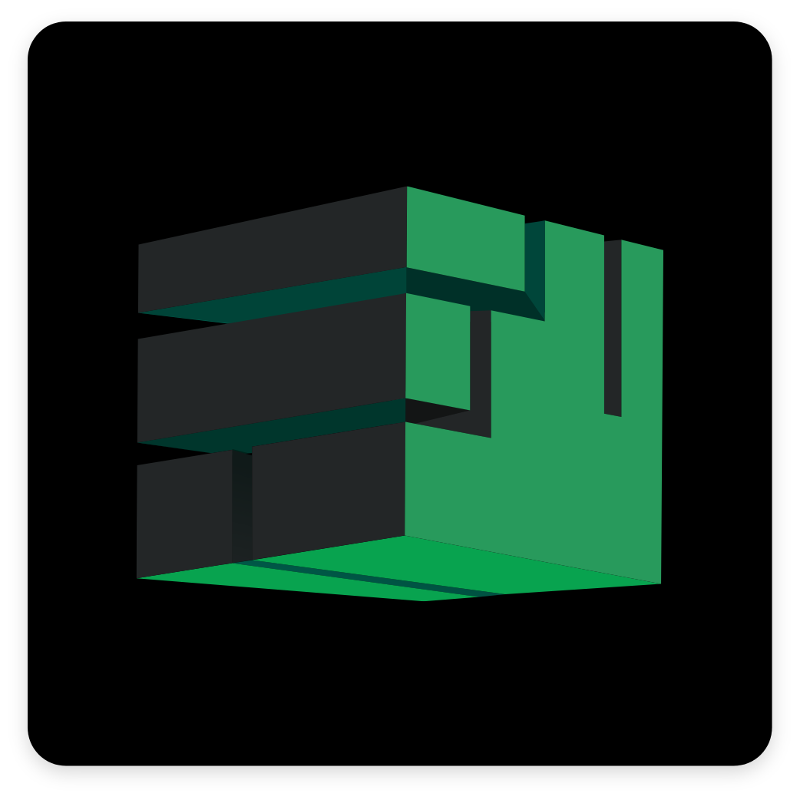

<!-- REPLACE ALL THE [LaraCassandra] TEXT WITH YOUR GITHUB PROFILE NAME & THE [MineCount] WITH THE NAME OF YOUR GITHUB PROJECT -->

<!-- Repository Information & Links-->
<br />


[![LinkedIn][linkedin-shield]][linkedin-url]
<!-- [![Instagram][instagram-shield]][instagram-url]
[![Behance][behance-shield]][behance-url] -->

<!-- HEADER SECTION -->
<h5 align="center" style="padding:0;margin:0;">Lara Cook</h5>
<h5 align="center" style="padding:0;margin:0;">190218</h5>
<h6 align="center">IDV302</h6>
</br>
<p align="center">

  <a href="https://github.com/LaraCassandra/MineCount">
    
  </a>
  
  <h3 align="center">MineCount</h3>

  <p align="center">
    Minecraft Inventory Tracker<br>
      <a href="https://github.com/LaraCassandra/MineCount"><strong>Explore the docs »</strong></a>
   <br />
   <br />
   <a href="path/to/demonstration/video">View Demo</a>
    ·
    <a href="https://github.com/LaraCassandra/MineCount/issues">Report Bug</a>
    ·
    <a href="https://github.com/LaraCassandra/MineCount/issues">Request Feature</a>
</p>
<!-- TABLE OF CONTENTS -->
## Table of Contents

- [Table of Contents](#table-of-contents)
- [About the Project](#about-the-project)
  - [Project Description](#project-description)
  - [Built With](#built-with)
- [Getting Started](#getting-started)
  - [Prerequisites](#prerequisites)
  - [How to install](#how-to-install)
  - [Installation](#installation)
- [Features and Functionality](#features-and-functionality)
  - [See and Update Item Count in Inventory](#see-and-update-item-count-in-inventory)
  - [Craft from Recipes](#craft-from-recipes)
- [Concept Process](#concept-process)
  - [Ideation](#ideation)
  - [Wireframes](#wireframes)
- [Development Process](#development-process)
  - [Implementation Process](#implementation-process)
    - [Highlights](#highlights)
    - [Challenges](#challenges)
  - [Future Implementation](#future-implementation)
- [Final Outcome](#final-outcome)
  - [Mockups](#mockups)
  - [Video Demonstration](#video-demonstration)
- [Roadmap](#roadmap)
- [Contributing](#contributing)
- [Authors](#authors)
- [License](#license)
- [Contact](#contact)
- [Acknowledgements](#acknowledgements)

<!--PROJECT DESCRIPTION-->
## About the Project
<!-- header image of project -->
![image1][image1]

### Project Description

MineCount is an interactive web 
application that acts as a Minecraft Inventory tracker. 
The user is able to track their Minecraft blocks and 
store the count in a database and craft recipes from 
those blocks.

### Built With

* [C#]([path/to/technology/website](https://docs.microsoft.com/en-us/dotnet/csharp/))
* [MySQL](https://www.mysql.com/)
* [HTML](https://developer.mozilla.org/en-US/docs/Web/HTML)
* [CSS](https://developer.mozilla.org/en-US/docs/Web/CSS)
* [Bootstrap](https://getbootstrap.com/)
* [GitHub](https://github.com/)
* [Visual Studio Code](https://code.visualstudio.com/)

<!-- GETTING STARTED -->
<!-- Make sure to add appropriate information about what prerequesite technologies the user would need and also the steps to install your project on their own mashines -->
## Getting Started

The following instructions will get you a copy of the project up and running on your local machine for development and testing purposes.

### Prerequisites

Ensure that you have the latest version of [Visual Studio Code](https://code.visualstudio.com/) installed on your machine. The [Plugin](path/to/where/they/can/download/plugin) plugin will also be required.

### How to install

### Installation
Here are a couple of ways to clone this repo:

1. Software Command-line </br>
`Visual Studio Code` -> `Terminal` -> `New Terminal` -> `Run the following`</br>
   ```sh
   git clone https://github.com/LaraCassandra/MineCount.git
   ```

1. Clone Repository </br>
Run the following in the command-line to clone the project:
   ```sh
   git clone https://github.com/LaraCassandra/MineCount.git
   ```
    Open `Software` and select `File | Open...` from the menu. Select cloned directory and press `Open` button


<!-- FEATURES AND FUNCTIONALITY-->
<!-- You can add the links to all of your imagery at the bottom of the file as references -->
## Features and Functionality

![image2][image2]
### See and Update Item Count in Inventory

See live count of inventory items and update item count

![image3][image3]
### Craft from Recipes

Craft items from recipes and live update inventory items

<!-- CONCEPT PROCESS -->
<!-- Briefly explain your concept ideation process -->
## Concept Process

The `Conceptual Process` is the set of actions, activities and research that was done when starting this project.

### Ideation

![image5][image4]
<br>

### Wireframes

![image6][image5]


<!-- DEVELOPMENT PROCESS -->
## Development Process

The `Development Process` is the technical implementations and functionality done in the frontend and backend of the application.

### Implementation Process
<!-- stipulate all of the functionality you included in the project -->

* Made use of both `HTML` and `Bootstrap` to create and design the frontend.
* Used C# to implement an `HTTP web server` to dynamically and statically display web pages.
* Made use of `Classes and Objects` to hold infomation of the blocks, recipes and functions to perform the necessary actions.
* `MVC` architecture was used as the structure for the development structure.
* The database was implemented with `MySQL`

#### Highlights
<!-- stipulated the highlight you experienced with the project -->
* A fun and `exciting theme` since I enjoy playing Minecraft
* Being able to `parse information` through to the frontend from the database in an effective and appealing way.
* Improving the `UI` to look more appealing and usable.

#### Challenges
<!-- stipulated the challenges you faced with the project and why you think you faced it or how you think you'll solve it (if not solved) -->
* Attempting to have the ability to craft items from their card tile.
* The recipes functionality in general.
* Continued confusion towards the concepts of `OOP`.

### Future Implementation
<!-- stipulate functionality and improvements that can be implemented in the future. -->

* Be able to `craft` a recipe straight from the item card (if applicable).
* `Connect the tracker` straight to Minecraft to directly track inventory.
* Add `categories` to find items better.

<!-- MOCKUPS -->
## Final Outcome

### Mockups

![image8][image6]
<br>
![image9][image7]

<!-- VIDEO DEMONSTRATION -->
### Video Demonstration

To see a run through of the application, click below:

[View Demonstration](path/to/video/demonstration)

<!-- ROADMAP -->
## Roadmap

See the [open issues](https://github.com/LaraCassandra/MineCount/issues) for a list of proposed features (and known issues).

<!-- CONTRIBUTING -->
## Contributing

Contributions are what makes the open-source community such an amazing place to learn, inspire, and create. Any contributions you make are **greatly appreciated**.

1. Fork the Project
2. Create your Feature Branch (`git checkout -b feature/AmazingFeature`)
3. Commit your Changes (`git commit -m 'Add some AmazingFeature'`)
4. Push to the Branch (`git push origin feature/AmazingFeature`)
5. Open a Pull Request

<!-- AUTHORS -->
## Authors

* **Your Name & Surname** - [LaraCassandra](https://github.com/LaraCassandra)

<!-- LICENSE -->
## License

Distributed under the MIT License. See `LICENSE` for more information.\

<!-- LICENSE -->
## Contact

* **Your Name & Surname** - [email@address](mailto:larac.cook@gmail.com)
* **Project Link** - https://github.com/LaraCassandra/MineCount

<!-- ACKNOWLEDGEMENTS -->
## Acknowledgements
<!-- all resources that you used and Acknowledgements here -->
* Lecturer: Christof Enslin
* [C# documentation](https://docs.microsoft.com/en-us/dotnet/csharp/)
* [Bootstrap](https:/www.getbootstrap.com/)
* [Minecraft Imagery](https://minecraft.fandom.com/wiki/Minecraft_Wiki)
* [Freepik](https:/www.freepik.com/home)
* [FlatIcon](https:/www.flaticon.com/)

<!-- MARKDOWN LINKS & IMAGES -->
[image1]: Images/image-1.png
[image2]: Images/image-2.png
[image3]: Images/image-3.png
[image4]: Images/image-4.png
[image5]: Images/image-5.png
[image6]: Images/image-6.png
[image7]: Images/image-7.png


<!-- Refer to https://shields.io/ for more information and options about the shield links at the top of the ReadMe file -->
[linkedin-shield]: https://img.shields.io/badge/-LinkedIn-black.svg?style=flat-square&logo=linkedin&colorB=555
[linkedin-url]: https://www.linkedin.com/in/laracassandra/
[instagram-shield]: https://img.shields.io/badge/-Instagram-black.svg?style=flat-square&logo=instagram&colorB=555
[instagram-url]: https://www.instagram.com/instagram_handle/
[behance-shield]: https://img.shields.io/badge/-Behance-black.svg?style=flat-square&logo=behance&colorB=555
[behance-url]: https://www.behance.net/name-on-behance/